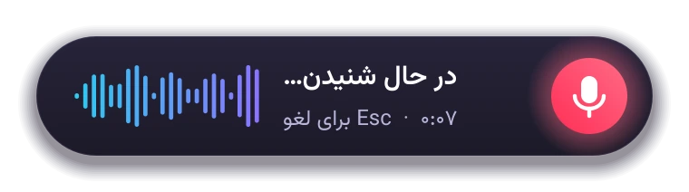
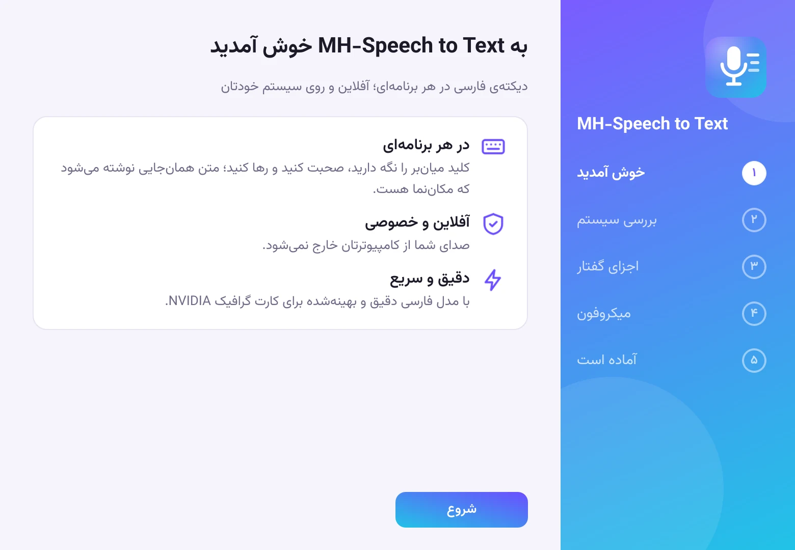
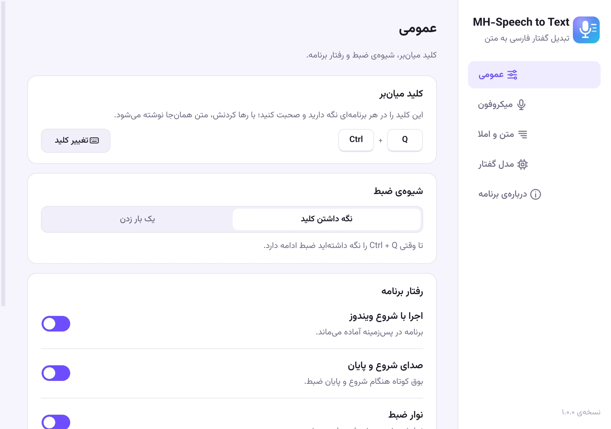

<div dir="rtl">

# MH-Speech to Text

**تبدیل گفتار فارسی به متن، در هر برنامه‌ای؛ آفلاین و روی سیستم خودتان.**

کلید میان‌بر (پیش‌فرض <kbd>Ctrl</kbd> + <kbd>Q</kbd>) را نگه دارید، صحبت کنید و رها کنید؛ متن همان‌جایی نوشته می‌شود که مکان‌نما هست: Word، مرورگر، تلگرام، ویرایشگر کد یا هر جای دیگری که بشود در آن تایپ کرد.

<p align="center"></p>

**[دانلود برای ویندوز](https://hajloo.ir/mh-speech-to-text/)** · رایگان و متن‌باز

## ویژگی‌ها

- **دقیق در فارسی محاوره:** مدل فارسی Whisper large-v3؛ کلمات را همان‌طور که گفته می‌شوند می‌نویسد و رسمی‌شان نمی‌کند.
- **سریع:** متن هم‌زمان با صحبت کردن آماده می‌شود و بعد از رها کردن کلید معمولاً کمتر از ۲ ثانیه طول می‌کشد (روی کارت گرافیک جداگانه‌ی NVIDIA، AMD یا Intel).
- **کاملاً آفلاین:** صدا از کامپیوتر خارج نمی‌شود و جایی ذخیره نمی‌شود.
- **املای درست:** نیم‌فاصله، «ی» و «ک» فارسی، علائم نگارشی و اعداد فارسی، بدون تغییر دادن کلمات.
- **جایگزینی کلمات:** املای دلخواه برای اصطلاحات پرکاربردتان.
- **دو شیوه‌ی ضبط:** نگه داشتن کلید، یا یک بار زدن برای شروع و یک بار برای پایان.
- **رابط کاملاً فارسی** با تم روشن و تیره، نوار ضبط شیشه‌ای و تاریخچه با تاریخ شمسی.

## نیازمندی‌ها

- ویندوز ۱۰ یا ۱۱ (۶۴ بیتی)
- کارت گرافیک NVIDIA، AMD یا Intel با دست‌کم ۴ گیگابایت حافظه (پیشنهادی؛ بدون آن برنامه روی پردازنده و کندتر کار می‌کند). در تنظیمات می‌توانید انتخاب کنید که گفتار روی کارت گرافیک پردازش شود یا پردازنده.
- حدود ۳ گیگابایت فضای خالی: ۱ گیگابایت برنامه و حدود ۱٫۶ گیگابایت مدل گفتار

## نصب و استفاده

1. فایل نصب را از [صفحه‌ی دانلود](https://hajloo.ir/mh-speech-to-text/) دریافت و اجرا کنید. برنامه مثل نرم‌افزارهای دیگر در `Program Files` نصب می‌شود.
2. در اولین اجرا، راهنمای راه‌اندازی مدل گفتار مناسب کارت گرافیک شما و (روی کامپیوترهای دارای کارت گرافیک NVIDIA) شتاب‌دهنده‌ی cuBLAS را یک بار دانلود می‌کند، یا از فایل اضافه می‌کند، و میکروفون را آزمایش می‌کند.
3. از این به بعد برنامه کنار ساعت ویندوز آماده است: <kbd>Ctrl</kbd> + <kbd>Q</kbd> را نگه دارید و صحبت کنید. برای لغو، وسط ضبط <kbd>Esc</kbd> بزنید.

تنظیمات (کلید میان‌بر، میکروفون، اعداد، جایگزینی کلمات، مدل و ...) از منوی آیکون برنامه در دسترس است.

<p align="center">
  
  
</p>

## ساخت از سورس

</div>

```powershell
python -m venv .venv
.venv\Scripts\pip install -r requirements.txt -r requirements-dev.txt -c constraints.txt
.venv\Scripts\pip install -r requirements-gpu.txt       # optional: NVIDIA GPU when running from source
.venv\Scripts\python tools\build_whispercpp.py          # whisper.cpp + Vulkan: AMD, Intel and NVIDIA cards
.venv\Scripts\pythonw "MH-Speech to Text.pyw"          # run from source
.venv\Scripts\python tools\build.py                     # build\installer\MH-Speech-to-Text-Setup-*.exe
```

<div dir="rtl">

ساخت whisper.cpp (موتور کارت‌های گرافیک AMD و Intel) به Visual Studio 2022 Build Tools (با C++) و [Vulkan SDK](https://vulkan.lunarg.com/sdk/home#windows)، و ساخت نصب‌کننده به [Inno Setup 6](https://jrsoftware.org/isinfo.php) نیاز دارد. نسخه‌های منتشرشده روی سرورهای GitHub Actions از همین کد ساخته می‌شوند ([build.yml](.github/workflows/build.yml)). سیاست امضای دیجیتال در [CODE_SIGNING_POLICY.md](CODE_SIGNING_POLICY.md) آمده است.

نصب‌کننده فقط کد متن‌باز دارد. کتابخانه‌ی cuBLAS از NVIDIA متن‌بسته است، پس در نصب‌کننده نیست و برنامه در اولین اجرا، فقط روی کامپیوترهای دارای کارت گرافیک NVIDIA، آن را دانلود می‌کند.

| مسیر | کاربرد |
|---|---|
| `dictation/` | خود برنامه: ضبط صدا، موتور تبدیل، اصلاح املا، درج متن و رابط کاربری (`ui/`) |
| `tools/benchmark.py` | مقایسه‌ی دقت و سرعت مدل‌ها روی صدای خودتان (`samples/`) |
| `tools/build_zwnj.py` | ساخت فهرست نیم‌فاصله از منابع با مجوز آزاد |
| `tools/build_whispercpp.py` | ساخت whisper.cpp با Vulkan برای کارت‌های گرافیک AMD، Intel و NVIDIA |
| `tools/convert_ggml.py` | تبدیل مدل Hugging Face به قالب whisper.cpp (سپس `whisper-quantize` با q8_0) |
| `installer/` | تنظیمات PyInstaller و Inno Setup |
| `website/` | صفحه‌ی دانلود برنامه؛ تصویرها و قلم‌هایش با `tools/make_site_assets.py` ساخته می‌شوند (نیازمندی‌ها: `requirements-site.txt`) |

## مجوز

این برنامه متن‌باز است و با [مجوز MIT](LICENSE) منتشر شده است. اجزای به‌کاررفته در آن هر کدام مجوز خود را دارند: Whisper و faster-whisper و CTranslate2 و whisper.cpp با مجوز MIT، مدل فارسی با Apache-2.0، Qt با LGPL-3.0، و قلم وزیرمتن، طراحی زنده‌یاد صابر راستی‌کردار، با مجوز OFL. فهرست کامل در `assets/NOTICE.txt` آمده است.

---

طراحی و توسعه: محمد حاجلو · [www.hajloo.ir](https://www.hajloo.ir) · [github.com/mhajloo](https://github.com/mhajloo/)

</div>

## Code signing policy

Free code signing provided by [SignPath.io](https://about.signpath.io/), certificate by [SignPath Foundation](https://signpath.org/). Team roles and the privacy policy: [CODE_SIGNING_POLICY.md](CODE_SIGNING_POLICY.md).
